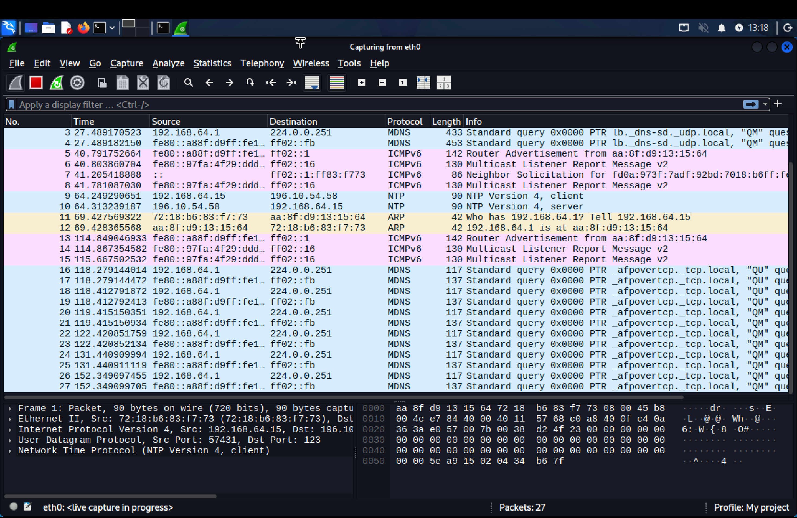
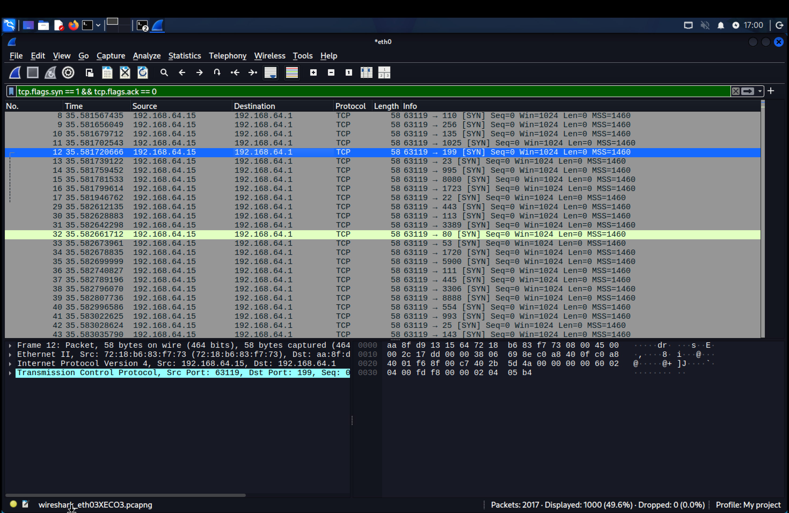
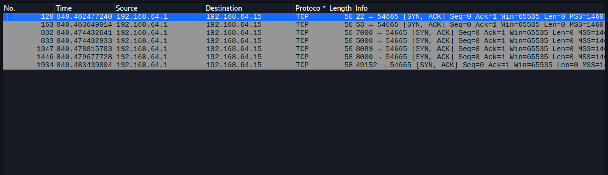
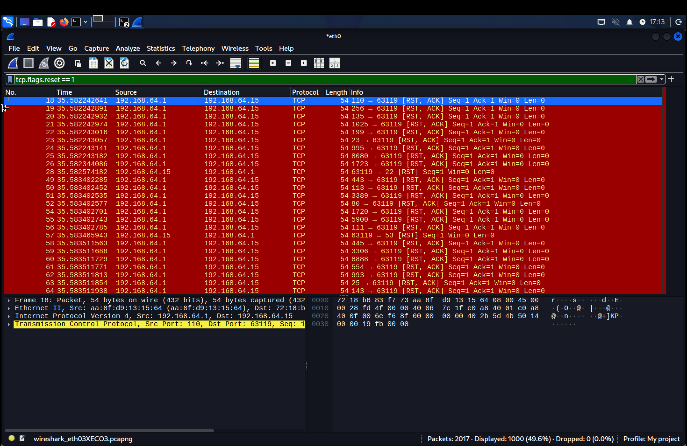
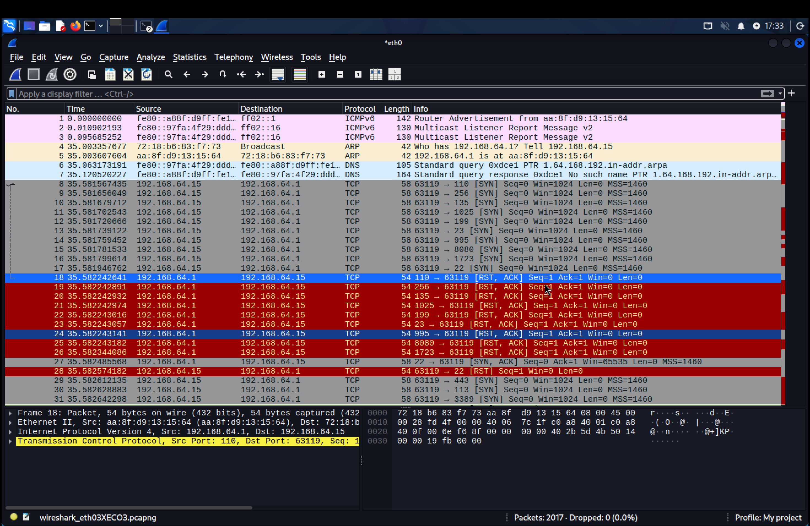
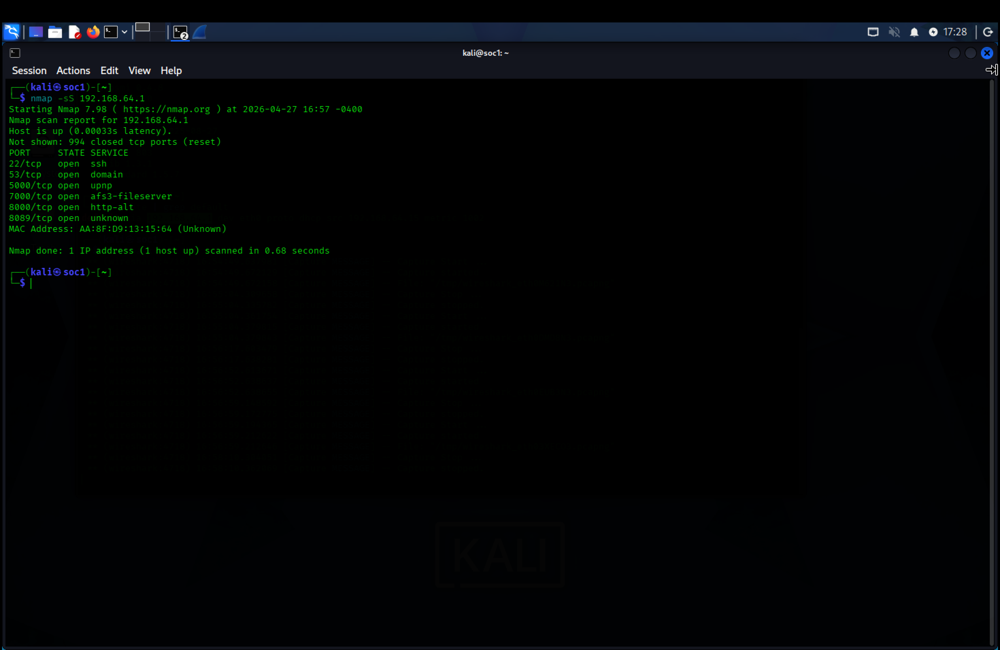

# Day 03 – SOC Tier 1 Incident Report: TCP SYN Port Scan Detection

---

## Incident Summary

- **Incident Type:** Network Reconnaissance (TCP SYN Port Scan)
- **Severity:** Medium
- **Detection Method:** Wireshark Packet Analysis
- **Tools Used:** Wireshark, Nmap, Linux Terminal
- **Status:** Confirmed Recon Activity

---

## Executive Summary

A suspected TCP SYN port scan was detected targeting a host system. The attacker attempted to identify open ports by sending multiple SYN packets without completing full TCP handshakes. The activity was confirmed through Wireshark traffic analysis and correlated with Nmap scan behavior.

This type of activity is commonly associated with the **reconnaissance phase of cyber attacks**, where attackers map exposed services before exploitation.

---

## Affected Asset

- **Target IP:** 192.168.1.x (lab environment)
- **Environment:** Simulated network lab
- **Exposure:** Multiple TCP ports probed

---

## Detection Methodology

### 1. Traffic Capture



- Captured live network traffic using Wireshark  
- Monitored interface for inbound connection attempts  
- Confirmed packet flow between source and target  

---

### 2. SYN Scan Identification

Filter Applied:

```bash id="synfilter"
tcp.flags.syn == 1 && tcp.flags.ack == 0
````



* Detected multiple SYN packets across different ports
* Observed sequential probing behavior
* Confirmed scanning pattern (no full TCP handshake)

---

### 3. Open Port Response Analysis



* Identified SYN-ACK responses from target system
* Confirmed open services:

  * Port 22 (SSH)
  * Port 80 (HTTP)
  * Port 443 (HTTPS)

---

### 4. Closed Port Detection

Filter Applied:

```bash id="rstfilter"
tcp.flags.reset == 1
```



* Observed RST responses from target system
* Confirmed ports that rejected connection attempts
* Indicated hardened or closed services

---

### 5. Packet-Level Inspection



* Analyzed TCP header fields:

  * SYN flag
  * ACK flag
  * RST flag
* Verified source and destination IP behavior
* Confirmed incomplete handshake pattern

---

### 6. Attack Correlation (Nmap)

```bash id="nmapscan"
nmap -sS 192.168.1.x
```



* Performed SYN scan using Nmap
* Generated traffic observed in Wireshark
* Validated scan-to-packet correlation

---

## Indicators of Compromise (IOCs)

* High volume of SYN packets across multiple ports
* No completed TCP 3-way handshake
* Sequential port probing pattern
* Presence of RST responses from target system
* External scanning tool (Nmap) activity detected

---

## MITRE ATT&CK Mapping

| Tactic           | Technique ID | Description               |
| ---------------- | ------------ | ------------------------- |
| Reconnaissance   | T1046        | Network Service Discovery |
| Network Scanning | T1046        | Port Scanning Activity    |

---

## Analyst Conclusion

The observed activity confirms a **TCP SYN port scan**, indicating reconnaissance behavior. The attacker attempted to enumerate open services on the target system.

No exploitation occurred; however, the scan indicates pre-attack intelligence gathering.

---

## SOC Analyst Action

* Monitor repeated scan attempts from same IP range
* Block suspicious IPs if behavior persists
* Enable IDS/IPS alerts for SYN flood patterns
* Log and correlate scan activity across network sensors

---

## Learning Outcome

This investigation demonstrates the ability to:

* Detect port scanning using Wireshark
* Identify TCP handshake anomalies
* Correlate attack tools with packet behavior
* Apply SOC-level reasoning to network traffic

---

## Repository Structure

```
.
├── README.md
├── screenshots/
│   ├── wireshark_capture.png
│   ├── syn_scan.png
│   ├── open_ports.png
│   ├── rst_packets.png
│   ├── packet_details.png
│   └── nmap_scan.png
```

---
