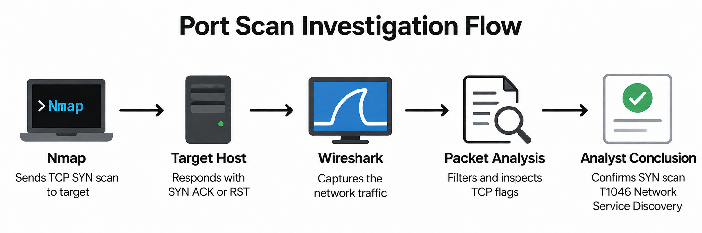

# TCP SYN Port Scan Detection with Wireshark

I investigated a TCP SYN port scan at the packet level, identified how the target responded to different probes, and correlated the network evidence with the Nmap activity that generated it.



**Investigation flow:** Nmap generated the SYN scan against the target. Wireshark captured the traffic, where I analyzed SYN, SYN ACK, and RST behavior before correlating the packets back to the scan.

## At a Glance

| Field | Detail |
| --- | --- |
| Activity | TCP SYN port scan |
| Investigation Type | Network reconnaissance |
| Detection Method | Wireshark packet capture and TCP flag analysis |
| Tools Used | Wireshark, Nmap, Linux terminal |
| Source | `192.168.64.15` |
| Target | `192.168.64.1` |
| MITRE ATT&CK | T1046 Network Service Discovery |
| Outcome | Network service discovery confirmed |

## What This Is

This project documents a packet level investigation of TCP SYN scanning.

The goal was not simply to run Nmap and record the result. I wanted to investigate what the activity looked like from the monitored side of the network and determine what the packet evidence could prove.

## Objective

The investigation focused on identifying the scan pattern, examining how the target responded to different TCP probes, validating the TCP flags directly, and correlating the observed traffic with the activity that generated it.

## Traffic Capture

### Action

I captured live traffic on the monitored interface in Wireshark before applying investigation filters.

### Evidence


### Analyst Reasoning

The capture confirmed that network traffic involving the lab systems was available for analysis.

Starting with the unfiltered traffic gave me a baseline before narrowing the investigation to specific TCP behavior.

**Verdict:** Packet telemetry was successfully captured and available for investigation.

## SYN Scan Identification

### Action

I filtered for TCP packets where SYN was set and ACK was not set.

```text
tcp.flags.syn == 1 && tcp.flags.ack == 0
```

### Evidence


### Analyst Reasoning

The filtered traffic shows repeated SYN packets from `192.168.64.15` to `192.168.64.1` across multiple destination ports.

A single SYN packet is normal connection behavior. Repeated SYN probes across many ports create a pattern consistent with network service discovery.

I did not classify the traffic from one packet alone. The pattern became meaningful when combined with the destination ports, target responses, and Nmap evidence.

**Verdict:** The packet pattern is consistent with automated TCP port probing.

## Open Port Response Analysis

### Action

I examined the target responses to determine which probes received SYN ACK packets.

### Evidence


### Analyst Reasoning

The target responded to some probes with SYN ACK packets.

A SYN ACK response is consistent with a listening TCP service responding to an incoming connection request.

These responses showed which services were exposed to the scanning host during the investigation.

**Verdict:** Some probed ports responded as listening TCP services.

## Closed Port Detection

### Action

I filtered the capture for TCP reset packets.

```text
tcp.flags.reset == 1
```

### Evidence


### Analyst Reasoning

The capture shows repeated RST ACK responses from the target.

These responses provided a different result from the SYN ACK packets and helped distinguish probes that reached listening services from probes that were refused.

Looking at both response types gave me more context than simply counting SYN packets.

**Verdict:** The target returned different TCP responses depending on the destination port being probed.

## Packet Level Inspection

### Action

I inspected individual packets and reviewed the TCP header fields directly.

### Evidence


### Analyst Reasoning

The packet details exposed the source, destination, ports, and TCP flags behind the traffic shown in the Wireshark summary.

This allowed me to validate the behavior at the protocol level instead of relying only on the packet list.

The TCP fields supported the same SYN scanning pattern identified earlier in the investigation.

**Verdict:** Direct TCP header inspection supported the SYN scan finding.

## Attack Correlation

### Action

I compared the Wireshark evidence with the Nmap activity used to generate the traffic.

```bash
nmap -sS 192.168.64.1
```

### Evidence


### Analyst Reasoning

The Nmap evidence shows SYN scanning activity against the same target observed in Wireshark.

This connected the action with the resulting telemetry.

Nmap showed what generated the activity. Wireshark showed what that activity looked like on the network.

The correlation strengthened the conclusion because the packet behavior could be explained by a known action rather than inferred from the traffic alone.

**Verdict:** The Nmap activity correlates with the SYN probing behavior observed in Wireshark.

## Investigation Findings

The investigation confirmed repeated TCP SYN probes across multiple destination ports.

The source observed in the packet evidence was `192.168.64.15`, with `192.168.64.1` appearing as the target of the scan traffic.

The target returned SYN ACK responses to some probes and reset responses to others.

Direct TCP header inspection supported the flag behavior visible in the packet list.

The observed network activity also correlated with the Nmap SYN scan performed in the lab.

Taken together, the evidence supports identifying the activity as TCP SYN based network service discovery.

## MITRE ATT&CK

| Tactic | Technique ID | Technique |
| --- | --- | --- |
| Discovery | T1046 | Network Service Discovery |

The observed behavior maps to **T1046 Network Service Discovery** because the scan probed TCP services on the target to determine what was reachable.

## Analyst Conclusion

The available packet evidence supports classifying the activity as a TCP SYN port scan used for network service discovery.

Repeated SYN probes were observed across multiple destination ports. The target returned different TCP responses, and the activity correlated with the Nmap SYN scan used in the lab.

The evidence shown in this investigation supports reconnaissance. It does not demonstrate exploitation or compromise.

**Verdict:** TCP SYN based network service discovery confirmed.

## Recommended Response

In a production environment, I would first determine whether the scanning source was authorized.

If the activity was unexpected, I would search for the same source across other network systems to determine whether additional hosts were scanned.

I would then correlate the activity with firewall, IDS, endpoint, and authentication telemetry to determine whether anything followed the reconnaissance.

Repeated unauthorized scanning could then be blocked or escalated according to the organization's response process.

## The SOC Angle

The important skill in this project was not running Nmap.

It was recognizing what scanning activity looks like from the monitored side of the network.

A SOC analyst may receive packet or network telemetry without knowing which tool generated it. Understanding SYN, SYN ACK, and RST behavior helps turn those packets into an investigation finding.

## Lessons Learned

### One packet is not enough

A SYN packet by itself is normal. The useful signal came from repeated SYN probes across multiple destination ports.

### Target responses matter

The investigation became stronger when I looked beyond the initial probes and examined how the target responded.

SYN ACK and reset packets provided additional context about the probed ports.

### Packet headers validate the finding

Inspecting the TCP fields directly helped confirm that the behavior visible in the Wireshark packet list matched the underlying protocol information.

### Correlation strengthens confidence

Wireshark showed the network behavior while Nmap showed the action that generated it.

Using both allowed me to explain the traffic rather than simply label it.

## What I Would Improve

### Add a time based threshold

I would measure how many unique destination ports one source probes within a short period.

This would make the behavior easier to translate into an IDS or SIEM detection.

### Compare against normal TCP traffic

I would capture legitimate TCP connections and compare their handshake behavior with the SYN scan.

This would provide a stronger baseline for distinguishing normal connections from reconnaissance.

### Add another telemetry source

I would correlate the packet capture with firewall or IDS logs from the same period.

This would test whether the same activity can be detected consistently across multiple telemetry sources.

### Extend the investigation window

I would investigate what happened after the scan and search for connections, authentication attempts, or other activity involving the services discovered during reconnaissance.

This would help determine whether the activity stopped at discovery or progressed further.

## What This Demonstrates

This project demonstrates my ability to:

- Capture and investigate network traffic in Wireshark
- Apply targeted TCP display filters
- Interpret SYN, SYN ACK, and RST behavior
- Recognize network reconnaissance from packet patterns
- Inspect TCP header fields directly
- Correlate packet evidence with Nmap activity
- Separate confirmed evidence from assumptions
- Map observed behavior to MITRE ATT&CK
- Reach an evidence based analyst conclusion
- Identify appropriate next investigation steps

## Repository Structure

```text
.
├── README.md
└── screenshots/
    ├── 00_architecture.png
    ├── wireshark_capture.png
    ├── syn_scan.png
    ├── open_ports.png
    ├── rst_packets.png
    ├── packet_details.png
    └── nmap_scan.png
```

## Author

**William Gokah**

SOC Analyst Portfolio

[](https://linkedin.com/in/WilliamInCyber)
[](https://x.com/WilliamInCyber)
